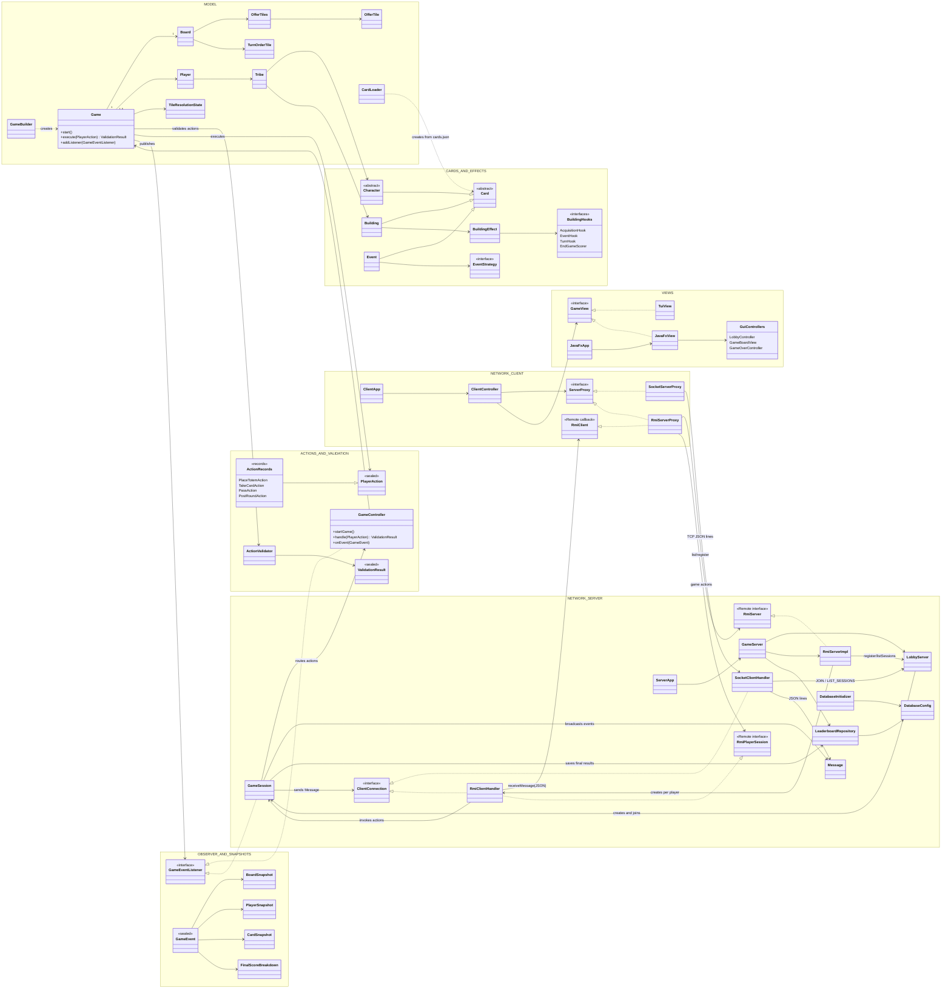

# High-Level UML Overview

This diagram is intentionally compact. It complements the generated full UML by
showing only the main architectural classes, extension points, and transport
boundaries.

```mermaid
classDiagram
direction LR

namespace MODEL {
    class Game {
        +start()
        +execute(PlayerAction) ValidationResult
        +addListener(GameEventListener)
    }
    class Board
    class Player
    class Tribe
    class OfferTiles
    class OfferTile
    class TurnOrderTile
    class TileResolutionState
    class GameBuilder
    class CardLoader
}

namespace CARDS_AND_EFFECTS {
    class Card {
        <<abstract>>
    }
    class Character {
        <<abstract>>
    }
    class Building
    class Event
    class BuildingEffect
    class EventStrategy {
        <<interface>>
    }
    class BuildingHooks {
        <<interfaces>>
        AcquisitionHook
        EventHook
        TurnHook
        EndGameScorer
    }
}

namespace ACTIONS_AND_VALIDATION {
    class GameController {
        +startGame()
        +handle(PlayerAction) ValidationResult
        +onEvent(GameEvent)
    }
    class PlayerAction {
        <<sealed>>
    }
    class ActionRecords {
        <<records>>
        PlaceTotemAction
        TakeCardAction
        PassAction
        PostRoundAction
    }
    class ActionValidator
    class ValidationResult {
        <<sealed>>
    }
}

namespace OBSERVER_AND_SNAPSHOTS {
    class GameEventListener {
        <<interface>>
    }
    class GameEvent {
        <<sealed>>
    }
    class BoardSnapshot
    class PlayerSnapshot
    class CardSnapshot
    class FinalScoreBreakdown
}

namespace NETWORK_SERVER {
    class ServerApp
    class GameServer
    class LobbyServer
    class GameSession
    class ClientConnection {
        <<interface>>
    }
    class SocketClientHandler
    class RmiServerImpl
    class RmiClientHandler
    class Message
    class RmiServer {
        <<Remote interface>>
    }
    class RmiPlayerSession {
        <<Remote interface>>
    }
    class LeaderboardRepository
    class DatabaseConfig
    class DatabaseInitializer
}

namespace NETWORK_CLIENT {
    class ClientApp
    class ClientController
    class ServerProxy {
        <<interface>>
    }
    class SocketServerProxy
    class RmiServerProxy
    class RmiClient {
        <<Remote callback>>
    }
}

namespace VIEWS {
    class GameView {
        <<interface>>
    }
    class TuiView
    class JavaFxView
    class JavaFxApp
    class GuiControllers {
        LobbyController
        GameBoardView
        GameOverController
    }
}

Character --|> Card
Building --|> Card
Event --|> Card
Building --> BuildingEffect
BuildingEffect --> BuildingHooks
Event --> EventStrategy
CardLoader ..> Card : creates from cards.json

GameBuilder ..> Game : creates
Game "1" --> "1" Board
Game "2..5" --> Player
Board --> OfferTiles
Board --> TurnOrderTile
OfferTiles --> OfferTile
Player --> Tribe
Tribe --> Character
Tribe --> Building
Game --> TileResolutionState

ActionRecords --|> PlayerAction
GameController --> Game
Game --> ActionValidator : validates actions
ActionValidator --> ValidationResult
Game --> PlayerAction : executes

Game --> GameEventListener : publishes
GameEventListener <|.. GameController
GameEventListener <|.. GameSession
GameEvent --> BoardSnapshot
GameEvent --> PlayerSnapshot
GameEvent --> CardSnapshot
GameEvent --> FinalScoreBreakdown

ServerApp --> GameServer
GameServer --> LobbyServer
GameServer --> RmiServerImpl
GameServer --> LeaderboardRepository
LobbyServer --> GameSession : creates and joins
GameSession --> GameController : routes actions
GameSession --> Message : broadcasts events
GameSession --> LeaderboardRepository : saves final results
ClientConnection <|.. SocketClientHandler
ClientConnection <|.. RmiClientHandler
GameSession --> ClientConnection : sends Message
SocketClientHandler --> LobbyServer : JOIN / LIST_SESSIONS
SocketClientHandler --> Message : JSON lines

RmiServer <|.. RmiServerImpl
RmiPlayerSession <|.. RmiClientHandler
RmiServerImpl --> LobbyServer : register/listSessions
RmiServerImpl --> RmiClientHandler : creates per player
RmiClientHandler --> GameSession : invokes actions
RmiClientHandler --> RmiClient : receiveMessage(JSON)

DatabaseInitializer --> DatabaseConfig
LeaderboardRepository --> DatabaseConfig

ClientApp --> ClientController
ClientController --> ServerProxy
ClientController --> GameView
ServerProxy <|.. SocketServerProxy
ServerProxy <|.. RmiServerProxy
RmiClient <|.. RmiServerProxy
SocketServerProxy --> SocketClientHandler : TCP JSON lines
RmiServerProxy --> RmiServer : list/register
RmiServerProxy --> RmiPlayerSession : game actions

GameView <|.. TuiView
GameView <|.. JavaFxView
JavaFxApp --> JavaFxView
JavaFxView --> GuiControllers
```
